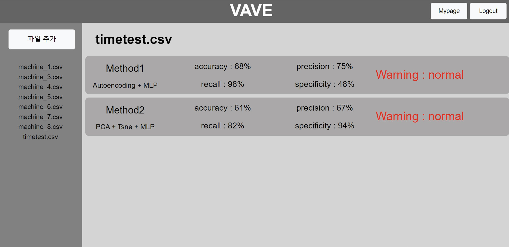

# VAVE

> VAVE는 기계의 현재 상태를 관리할 수 있는 웹 형태의 소프트웨어입니다. 진동 데이터를 넣어준다면, 다양한 종류의 상태 분류 모델을 확인 가능합니다.

오늘날 새로운 기술과 지능화된 시스템의 등장으로 인해 기계 장치가 나날이 발전하고 있다. 반면 그에 따른 불확실성과 복잡성 역시 크게 증가하고 있는 추세이다. 이러한 복잡한 기계 설비 구조는 노후화된 설비룰 유지보수하기에 어려움을 주어 기계 작동에 영향을 미치게 된다. 여기서 기계 고장은 설비 정지, 유지 보수 비용 등의 악영향을 발생시켜 사고예지 및 보전 기술의 필요성이 대두되고 있다.

## Pages

- [논문](https://ieeexplore.ieee.org/document/10020238)

## 사용법

1. 해당 레포지토리를 git clone한 후, `web/vavefront` 폴더에서 `npm run start`, `web/vaveback` 폴더에서 `node index.js` 명령어를 통해 실행한다.
2. `model/nodelback` 폴더의 `python main.py`를 통해 FastApi를 구동한다.

- 따로 서버용 데이터베이스가 구축되어있지 않아, 로컬 데이터베이스 연결 후 구동해주시기 바랍니다.

## wiki page

vave에 대해 더 자세히 알고 싶다면, 다음 [wiki page](https://royal-tiger-88d.notion.site/VAVE-b433d51e61bf440ca5584ba72ac13dc0)를 참고해주시길 바랍니다.
